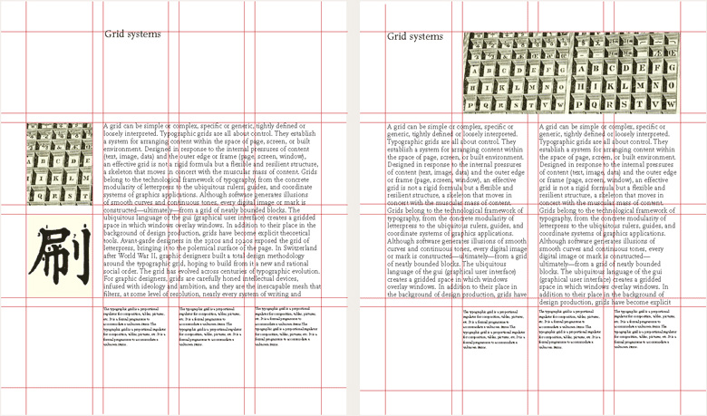

<portfolio-header>
  <h2>Architecture & Asymmetry</h2>
  
  
</portfolio-header>

The Crump Firm is a Memphis based based architecture firm that's been designing both public and private buildings for almost 50 years. In line with the firm's mission statement of "Creating Inspired Architecture That Endures," RocketFuel designed a unique site based heavily on photography that was also meant to endure.

> I tried to keep it minimalistic, open and elegant to show off their architecture work since they had such good photos. I also wanted the site to have a feeling of modern architecture and some deliberate and meaningful asymmetry as a nod to floor plans and architectural elements.

Donec sed odio dui. Donec ullamcorper nulla non metus auctor fringilla. Vivamus sagittis lacus vel augue laoreet rutrum faucibus dolor auctor. Integer posuere erat a ante venenatis dapibus posuere velit aliquet. Curabitur blandit tempus porttitor.

Maecenas sed diam eget risus varius blandit sit amet non magna. Donec ullamcorper nulla non metus auctor fringilla. Curabitur blandit tempus porttitor. Etiam porta sem malesuada magna mollis euismod. Nullam quis risus eget urna mollis ornare vel eu leo. Aenean eu leo quam. Pellentesque ornare sem lacinia quam venenatis vestibulum. Maecenas faucibus mollis interdum.

Etiam porta sem malesuada magna mollis euismod. Donec id elit non mi porta gravida at eget metus. Cras mattis consectetur purus sit amet fermentum. Cum sociis natoque penatibus et magnis dis parturient montes, nascetur ridiculus mus. Maecenas sed diam eget risus varius blandit sit amet non magna.

<portfolio-header>
  <h2>Testing second header</h2>
  
</portfolio-header>

Donec sed odio dui. Donec ullamcorper nulla non metus auctor fringilla. Vivamus sagittis lacus vel augue laoreet rutrum faucibus dolor auctor. Integer posuere erat a ante venenatis dapibus posuere velit aliquet. Curabitur blandit tempus porttitor.

Maecenas sed diam eget risus varius blandit sit amet non magna. Donec ullamcorper nulla non metus auctor fringilla. Curabitur blandit tempus porttitor. Etiam porta sem malesuada magna mollis euismod. Nullam quis risus eget urna mollis ornare vel eu leo. Aenean eu leo quam. Pellentesque ornare sem lacinia quam venenatis vestibulum. Maecenas faucibus mollis interdum.

Etiam porta sem malesuada magna mollis euismod. Donec id elit non mi porta gravida at eget metus. Cras mattis consectetur purus sit amet fermentum. Cum sociis natoque penatibus et magnis dis parturient montes, nascetur ridiculus mus. Maecenas sed diam eget risus varius blandit sit amet non magna.