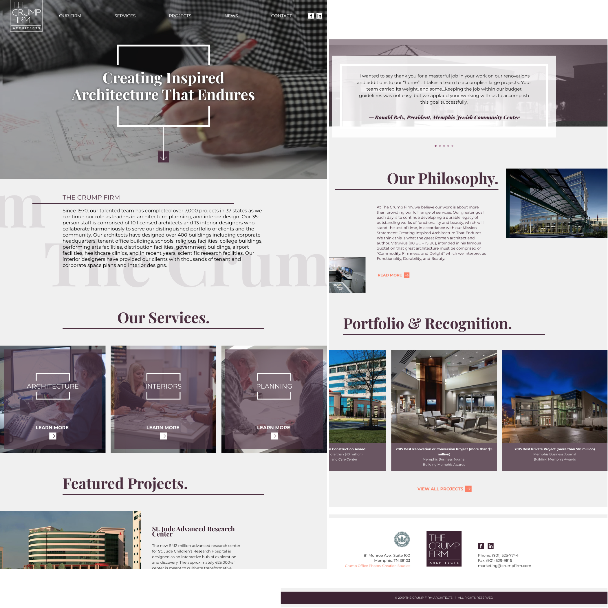

<portfolio-header>
  <h2>Project Introduction (need a better title?)</h2>
  
  <!--  -->
  <!--  -->
</portfolio-header>


The Crump Firm is a Memphis based based architecture firm that's been designing both public and private buildings for almost 50 years. In line with the firm's mission statement of "Creating Inspired Architecture That Endures," RocketFuel designed a unique site based heavily on photography that was also meant to endure.

Because the clients were able to provide a large amount of great photography and the existing branding already being minimal, the site was mostly built around large areas of flat color combined with large images.

<portfolio-header>
  <h2>Architecture & Asymmetry</h2>
  
</portfolio-header>

>I wanted the site to have a feeling of modern architecture and some deliberate and meaningful asymmetry as a nod to floor plans and architectural elements.
><cite>Art Director</cite>

Achieving such a irregular design within the constraints of client editable content meant reworking how the RocketFuel CMS handled content placement. Normally all elements are place in a central container which is give a max-width to maintain both readability and the design aesthetic. 

Instead, this column was made the full width of the page, and any direct elements inside were given a max-width. Since image placement is handled with left and right floats, this layout system let them go to the outer most edges of the page while keeping text content centered at a readable width. This system also worked on pages that needed a left-hand sidebar, and left floated images could be pulled over to overlap with a negative margin.

<portfolio-header>
  <h2>Many Types of Grid Styles</h2>
  
</portfolio-header>

Because of the architectural theme used throughout the site, a number of different grid styles were used in different sections. In order to not duplicate both markup and styles, I developed a template system using the [Twig](https://twig.symfony.com/) extends functionality that would uniformly render the outer html of each grid item.

``` twig
// card.twig
<article class="card ">
       
</article>

// team-member.twig



    team-member-card



    <a href="{{ list_item.uri }}"">
      content...        
    </a>

```

By keeping the outer markup the same, this made applying any styles to _all_ grid items very easy. The consistency also made them very easy to target with a simple scss mixin.

``` scss
@mixin grid($columns: 3, $gap: $container-padding, $offset: 0) {
    
  $size: calc(100% / #{$columns});

  box-sizing: border-box;
  display: flex;
  flex-wrap: wrap;
  padding-left: $gap;
  margin-left: -$gap;
  margin-right: -$gap;
  width: calc(100% + 2*#{$gap});
  margin-bottom: -$gap;

  > * {
      margin-right: $gap;
      margin-bottom: $gap;
      width: 100%;
      max-width: calc(#{$size} - #{$gap});

    &:nth-child(odd) {
      position: relative;
      top: $offset;
    }
  }
}
```

RocketFuel has a pretty standard [React Redux filter](https://www.npmjs.com/package/redux-filter) to use for grids that need to be dynamically filtered by criteria, such as news or projects. React is given a mount point that wraps the original Twig-rendered grid and replaces DOM elements with the same class names so the same css will be applied. This way, should Javascript fail or be turned off a user will still be able to access the original items.

Along the same lines as the Twig extension, I created a wrapping React component that would accept an item type as a prop and dynamically render it inside a common wrapper.

``` javascript
import React, {Component} from 'react';
import NewsArticle from './NewsArticle';
import Project from './Project';

export default class Card extends Component {

    render() {
        const { item, template, className } = this.props;

        const templates = {
            NewsArticle: NewsArticle,
            Project: Project
        };

        const render = {
            template: templates[template]
        };

        return (
            <article className={`card ${className}`}>
                <render.template item={item} />
            </article>
        );
    }
}
```


<portfolio-header>
  <h2>Frosted Mobile Nav</h2>
  
</portfolio-header>

The main demographic for this website was going to be desktop users viewing large imagery, but there were still opportunities to make references to the client's architectural style in the responsive version of the site. The Crump Firm Incorporate a lot of glass into their interior design, and we saw the opportunity to do something similar with site's mobile navigation.

<iframe height="350" style="width: 100%;" scrolling="no" title="Crump Navicon" src="//codepen.io/ryanfiller89/embed/gvMLJQ/?height=325&theme-id=0&default-tab=result" frameborder="no" allowtransparency="true" allowfullscreen="true">
</iframe>