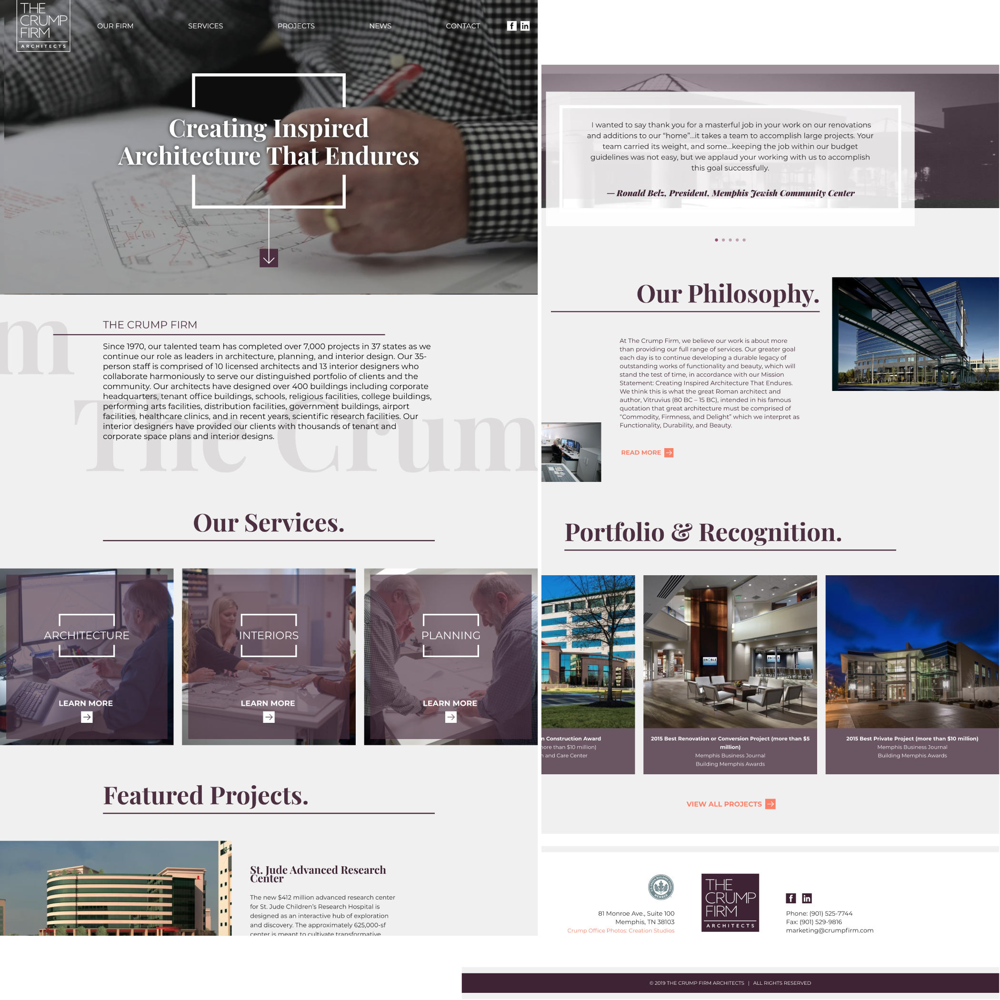
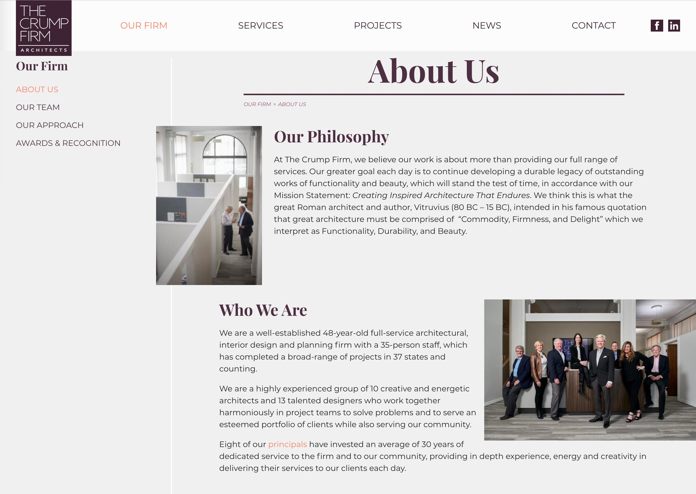
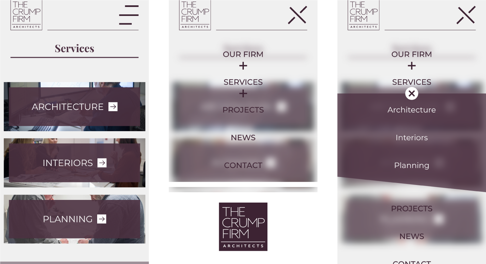
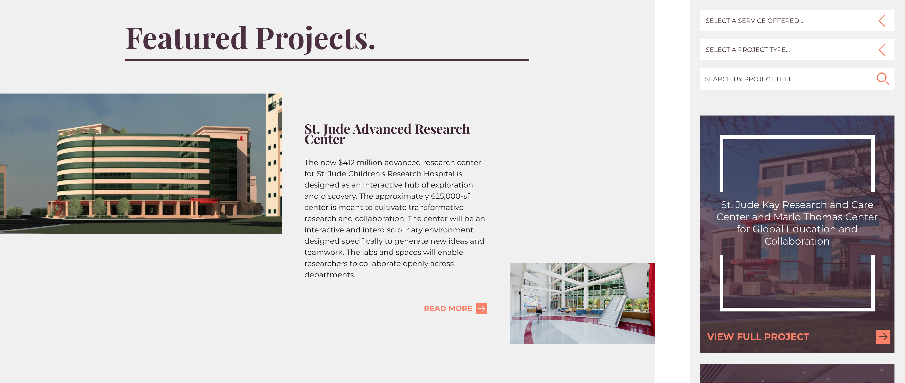

<PortfolioHeader>
  <h2>An Architecture Inspired Site</h2>
  
</PortfolioHeader>

<!--
<PortfolioHeader>
  <h2>An Architecture Inspired Site</h2>
  
</PortfolioHeader>
-->

The Crump Firm is a Memphis based architecture firm that has worked to design both public and private buildings for almost 50 years. Building upon the firm's mission statement of "Creating Inspired Architecture That Endures," RocketFuel created a unique site based heavily on photography that is also meant to endure.

Starting with the brand's minimal branding alongside an extensive collection of eye-catching, client-provided photography — the site came to life as large spaces of flat color combined with large images.

<!--
<PortfolioHeader>
  <h2>Architecture & Asymmetry</h2>
  
</PortfolioHeader>
-->

>I wanted the site to have a feeling of modern architecture and some deliberate and meaningful asymmetry as a nod to floor plans and architectural elements.
><cite>Art Director</cite>

Achieving this irregular design within the constraints of client editable content meant reworking how the RocketFuel CMS handled content placement. Normally all elements are place in a central container which is given a max-width to maintain both readability and the design aesthetic. 

Instead, this column was made the full width of the page, and any direct elements inside were given a max-width. Since image placement is handled with left and right floats, this layout system lets them be positioned relative to the outer most edges of the page while keeping text content centered at a readable width. This system also worked on pages that needed a left-hand sidebar, and left floated images could be pulled over to overlap with a negative margin.

<!--
<PortfolioHeader>
  <h2>Many Types of Grid Styles</h2>
  
</PortfolioHeader>
-->

Because of the architectural theme used throughout the site, a number of unique grid styles were used in different sections. In order to not duplicate both markup and styles, I developed a template system using the [Twig](https://twig.symfony.com/) extends functionality to uniformly render the outer html of each grid item.

``` twig
// card.twig
<article class="card ">
    
</article>

// team-member.twig



    team-member-card



    <a href="{{ list_item.uri }}"">
      content...
    </a>

```

Keeping the outer markup the same made applying any styles to _all_ grid items very easy. This consistency also made it straightfoward to target grid items with a simple scss mixin.

``` scss
@mixin grid($columns: 3, $gap: $container-padding, $offset: 0) {
    
  $size: calc(100% / #{$columns});

  box-sizing: border-box;
  display: flex;
  flex-wrap: wrap;
  padding-left: $gap;
  margin-left: -$gap;
  margin-right: -$gap;
  width: calc(100% + 2*#{$gap});
  margin-bottom: -$gap;

  > * {
      margin-right: $gap;
      margin-bottom: $gap;
      width: 100%;
      max-width: calc(#{$size} - #{$gap});

    &:nth-child(odd) {
      position: relative;
      top: $offset;
    }
  }
}
```

RocketFuel has a pretty standard [React Redux filter](https://www.npmjs.com/package/redux-filter) to use for grids that need to be dynamically filtered by criteria, such as news or projects. React is given a mount point that wraps the original Twig-rendered grid and replaces DOM elements with the same class names so the same css will be applied. This way, should Javascript fail or be turned off, a user will still be able to access the original items.

Along the same lines as the Twig extension, I created a wrapping React component that would accept an item type as a prop and dynamically render it inside a common wrapper.

``` javascript
import React, {Component} from 'react';
import NewsArticle from './NewsArticle';
import Project from './Project';

export default class Card extends Component {

    render() {
        const { item, template, className } = this.props;

        const templates = {
            NewsArticle: NewsArticle,
            Project: Project
        };

        const render = {
            template: templates[template]
        };

        return (
            <article className={`card ${className}`}>
                <render.template item={item} />
            </article>
        );
    }
}
```

<!--
<PortfolioHeader>
  <h2>Frosted Mobile Nav</h2>
  
</PortfolioHeader>
-->

While the primary demographic for this website are desktop users viewing large photgraphy, there were still opportunities to reference the client's architectural style in the responsive version of the site. The Crump Firm incorporates glass features into their interior design, and we saw an opportunity to play off of this in a similar manner in site's mobile navigation.

<iframe height="350" style="width: 100%;" scrolling="no" title="Crump Navicon" src="//codepen.io/ryanfiller89/embed/gvMLJQ/?height=325&theme-id=0&default-tab=result" frameborder="no" allowtransparency="true" allowFullScreen={true}>
</iframe>

Since the [`backdrop-filter`](https://developer.mozilla.org/en-US/docs/Web/CSS/backdrop-filter) property wasn't supported in many browser at the time of developing this site, this effect was achieved by placing the mobile nav above the rest of the site and applying a [`filter`](https://developer.mozilla.org/en-US/docs/Web/CSS/filter) to the element wrapping the rest of the site.

``` html
// html
<div class="site-wrap">
  <div class="mobile-nav-overlay"></div>

  <div class="site">
    content...
  </div>
</div>

// css
.site {
    .open & {
        filter: blur(10px);
        max-height: 100vh;
        overflow: hidden;
    }
}
```

<!--
<PortfolioHeader>
  <h2>Takeaways From This Project</h2>
  
</PortfolioHeader>
-->

This was a fun project to work on and was more irregular and asymmetric than most websites I've developed. Flexbox is a super powerful tool to achieve layouts like this. Having three elements in a flexed row and giving them all very specific flex grow values like `46.25`, `30`, and `23.75`, and `align-self` values of `flex-start`, `stretch` and `flex-end` can be a great way to build a very fluid design that still maintains a specific aspect ratio.

Also, when working with so many card styles that all hide information behind a hover interaction, it can be helpful to this hover state to a scss mixin. This make it very easy to all this both inside a `&:hover` declaration, as well as inside of an `@media` query so that on touch only devices this information can be the default.
