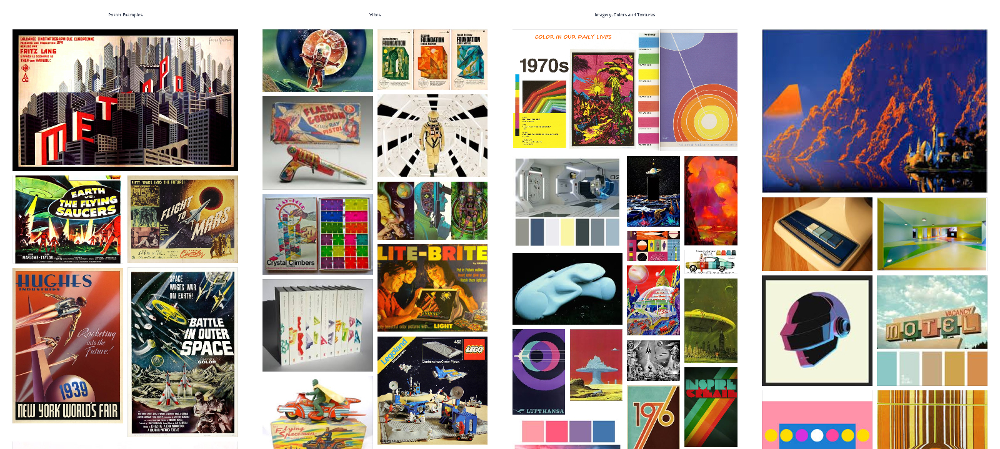
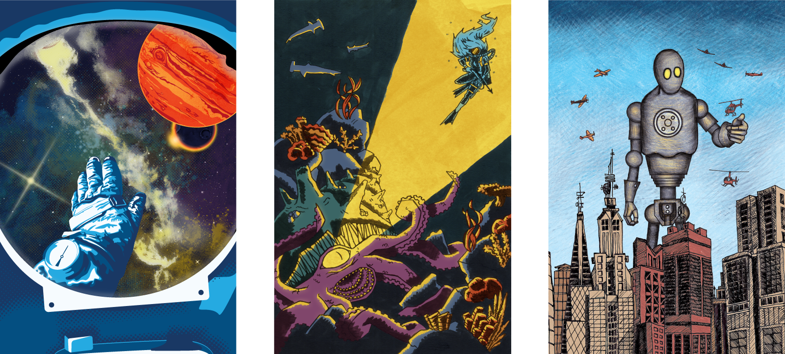

Indie Memphis is a local organization that hosts a several independent film festivals throughout the year. For their fall 2016 festival, RocketFuel exchanged a sponsorship for the opportunity to created a series of leave-behinds in the form of postcards. To match the theme of "Film for All," the theme of the postcards was to choose from a long lineage of film history.

## A Shoutout to Film History

[[imgFull]]
| 

[[imgLeft]]
| 
We decided on three postcards with each designer pulling from a differnet section of B movie history. My postcard focused on the trope of "man vs monster," and pulled inpiration from illustrated monster movie posters going back to the 1950's. The font choices on the back of the card also reflected this time period.

My postcard combined traditionally inked illustrations on bristol board that were scanned and then colored digitally in Photoshop. Some of the darker areas were ink washed in several semi transparent layers to give an underwater effect.

[[imgFull]]
| 

## Working Within a Series

Saturated colors were chosen as a reference to the time period and inspiration images, but also to make sure they worked as a set with the other postcards being illustrated. In addition to sharing a bold, blueish color scheme, the series also shares a theme of anxiety – anxiety of emptyness, anxiety of the unknown, and anxiety of being misunderstood.

[[imgFull]]
| 
